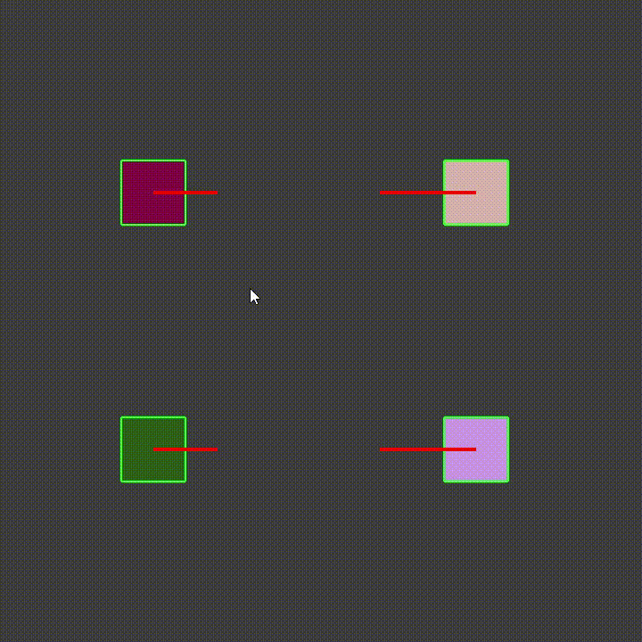
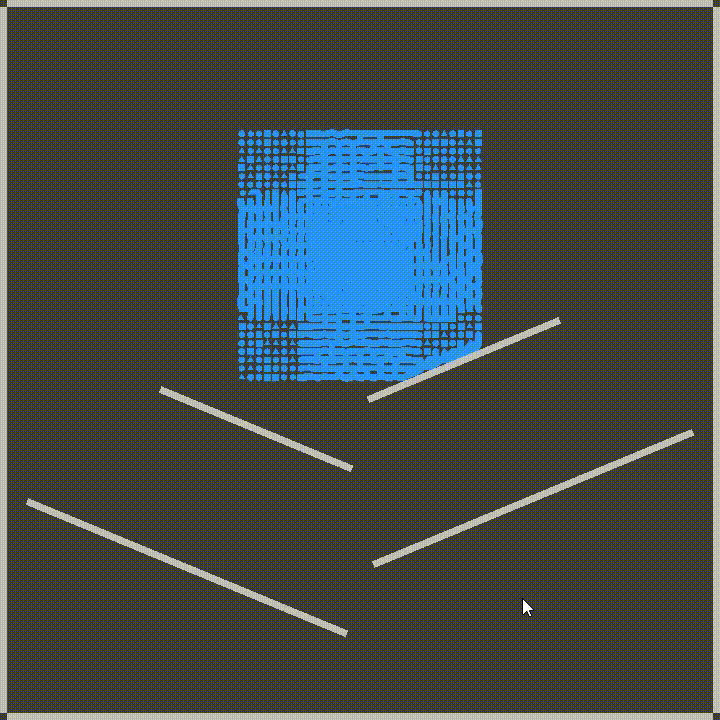
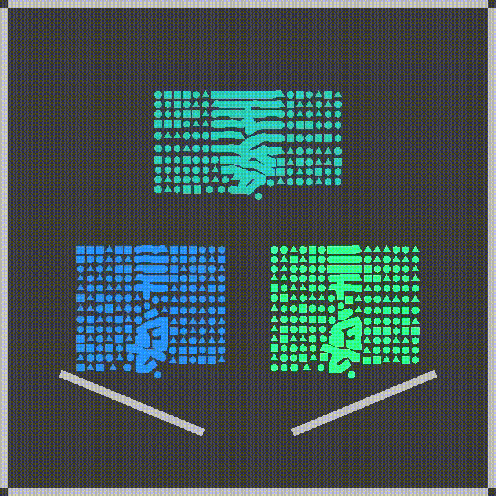

# AFLengine - A 2D rigid body and fluid dynamics physics engine

## Table of Contents
1. [Abstract](#abstract)
2. [Technical details](#technical-details)
3. [Usage](#usage)
4. [Debugging](#debugging)
5. [Examples](#examples)
6. [Limitations](#limitations)

## Abstract
**AFLengine** is a two dimensional physics engine. It is based on classical mechanics (Newtonian physics) and provides architecture and data structuring which facilitate modeling the consecrated and well established laws. This project covers rigid body and fluid dynamics. Collision response is treated with impulse based methods, while fluids are implementated using the smoothed particle hydrodynamics theoretical model. The project also provides a different perspective to the related work by supporting any convex shape for particles, whereas classical approaches only consider circular (or spherical for higher dimensions) particles.

The engine provides minimal rendering capabilities by making use of the GLUT interface for OpenGL. While rigid bodies are covered with primitives, **AFLengine** provides a state of the art method for rendering fluids which only relies on vertex manipulation with no added post-processing shader.

## Technical details
**AFLengine** is a solution being developed from scratch in C++ language. This was the obvious choice since the main focus of the project is efficiency and speed.

Boost libraries are used for various operational tasks, such as command line argument parsing, time retrieval and formatting and class serialization.

In order to provide graphical support for rendering the scene the OpenGL API was used. Compared to other popular graphical API’s, OpenGL achieves one of the best performances while being free and cross platform. In order to facilitate communication with the OpenGL API, GLUT (OpenGL Utility Toolkit) was used as a baseline framework. It provides primitives for drawing lines, basic shapes (triangles), wireframes and text, in addition to handling window management, input and the main event processing loop. In addition, SOIL (Simple OpenGL Image Library) has been used to load images into the engine.

The choice of the development language (C++) and rendering interface (OpenGL) offers the possibility of cross-platform support. All things considered, all the efforts were focused on compiling, running and testing **AFLengine** on Microsoft Windows 64 bit.

## Usage

### Building, linking and compiling
The project includes a *sln* file set up for compiling and building this project.

Requirements:

* *include* folder with 3 subfolders:
  * *boost*: [boost](https://www.boost.org/) header files
  * *GL*: [GLUT](https://www.opengl.org/resources/libraries/glut/) header files
  * *SOIL*: [Simple OpenGL Image Library](https://www.lonesock.net/soil.html) header files
* *lib* folder with compiled libraries:
  * *freeglut.lib*
  * *libboost_date_time.lib*, *libboost_program_options.lib*, *libboost_serialization.lib*
  * *SOIL.lib*

### Running
**AFLengine** can be run as a standalone application. It receives command line arguments. Some example of world files can be found in the *scenes/* folder.
```
AFLengine.exe --help
Options:
-h [ --help ] Help screen
-f [ --file ] arg World description file
-l [ --log ] arg Log file
-d [ --debug ] arg (=0) Show debug messages in log file
--width arg (=1280) Window width
--height arg (=720) Window height
```

### Code integration
**AFLengine** can be used as base of a framework for physics simulation. Objects can be created and editted programatically. Below there is a code snippet creating a wall.
```
SceneObjectRef obj;
RigidBody* rb;
Collider* col;
ShapeRenderer* sh;

obj = ObjectFactory::createSceneObject ();

col = new RectangleCollider ();
obj->addComponent (ComponentRef (col));

rb = new RigidBody ();
rb->elasticity = 1.0;
rb->mass = 100;
obj->addComponent (ComponentRef (rb));

sh = new ShapeRenderer ();
sh->color = Color::GRAY;
obj->addComponent (ComponentRef (sh));

ic = new ImmovableConstraint ();
ic->setFixedTransform (obj->transform);
obj->addComponent (ComponentRef (ic));

obj->transform->position = Vector2 (10, 10);
obj->transform->rotation = M_PI / 8;
obj->transform->scale = Vector2 (3, 3);
```

## Debugging

### GIZMOS
An optional rendering layer with debug information for each component. Three levels are supported (*None*, *Selected* and *All*).

Currently implemented GIZMOS:
* local coordinate system
* velocity
* collider shape
* spring force

### Log file
A logging mechanism has been created to assist debugging. Four debugging levels are supported (*Debug*, *Info*, *Warning* and *Error*). By default, a console log stream for error level is enabled and a file stream can be added through the command line. More streams can be added programmatically.
```
13:42:47.939355	[  Info ]	[Managers\WorldParser.cpp  -  55]	File loaded successfully: rigid_1000.afl

13:42:48.242943	[  Info ]	[Managers\Time_.cpp        -  96]	Frame:      70. Delta time: 0.00500. FPS: 227.27
13:42:48.244955	[  Info ]	[Managers\Physics.cpp      - 107]	Collison: [Obj 77] [Obj 76]
13:42:48.245954	[  Info ]	[Managers\Physics.cpp      - 107]	Collison: [Obj 895] [Obj 927]
13:42:48.245954	[  Info ]	[Managers\Physics.cpp      - 133]	Collisions detected: 2 (Average 0.42)
13:42:48.247958	[  Info ]	[Managers\Time_.cpp        -  96]	Frame:      71. Delta time: 0.00500. FPS: 226.24
13:42:48.249940	[  Info ]	[Managers\Physics.cpp      - 107]	Collison: [Obj 512] [Obj 544]
13:42:48.250940	[  Info ]	[Managers\Physics.cpp      - 133]	Collisions detected: 1 (Average 0.44)
13:42:48.251940	[  Info ]	[Managers\Time_.cpp        -  96]	Frame:      72. Delta time: 0.00400. FPS: 226.24
13:42:48.253939	[  Info ]	[Managers\Physics.cpp      - 107]	Collison: [Obj 166] [Obj 198]
13:42:48.254939	[  Info ]	[Managers\Physics.cpp      - 133]	Collisions detected: 1 (Average 0.46)
13:42:48.256938	[  Info ]	[Managers\Time_.cpp        -  96]	Frame:      73. Delta time: 0.00400. FPS: 226.24
13:42:48.258950	[  Info ]	[Managers\Physics.cpp      - 107]	Collison: [Obj 373] [Obj 405]
13:42:48.258950	[  Info ]	[Managers\Physics.cpp      - 133]	Collisions detected: 1 (Average 0.48)
13:42:48.260937	[  Info ]	[Managers\Time_.cpp        -  96]	Frame:      74. Delta time: 0.00500. FPS: 225.23
13:42:48.262936	[  Info ]	[Managers\Physics.cpp      - 107]	Collison: [Obj 29] [Obj 61]
13:42:48.262936	[  Info ]	[Managers\Physics.cpp      - 107]	Collison: [Obj 279] [Obj 311]
13:42:48.263936	[  Info ]	[Managers\Physics.cpp      - 133]	Collisions detected: 2 (Average 0.52)
13:42:48.265935	[  Info ]	[Managers\Time_.cpp        -  96]	Frame:      75. Delta time: 0.00500. FPS: 225.23
13:42:48.267934	[  Info ]	[Managers\Physics.cpp      - 107]	Collison: [Obj 194] [Obj 226]
13:42:48.267934	[  Info ]	[Managers\Physics.cpp      - 107]	Collison: [Obj 787] [Obj 819]
13:42:48.267934	[  Info ]	[Managers\Physics.cpp      - 133]	Collisions detected: 2 (Average 0.56)
13:42:48.269940	[  Info ]	[Managers\Time_.cpp        -  96]	Frame:      76. Delta time: 0.00400. FPS: 225.23
13:42:48.271933	[  Info ]	[Managers\Physics.cpp      - 107]	Collison: [Obj 221] [Obj 253]
13:42:48.271933	[  Info ]	[Managers\Physics.cpp      - 107]	Collison: [Obj 392] [Obj 424]
13:42:48.271933	[  Info ]	[Managers\Physics.cpp      - 107]	Collison: [Obj 398] [Obj 430]
13:42:48.271933	[  Info ]	[Managers\Physics.cpp      - 107]	Collison: [Obj 446] [Obj 445]
13:42:48.272933	[  Info ]	[Managers\Physics.cpp      - 107]	Collison: [Obj 517] [Obj 518]
13:42:48.272933	[  Info ]	[Managers\Physics.cpp      - 133]	Collisions detected: 5 (Average 0.66)
13:42:48.275931	[  Info ]	[Managers\Time_.cpp        -  96]	Frame:      77. Delta time: 0.00600. FPS: 223.21
13:42:48.277944	[  Info ]	[Managers\Physics.cpp      - 107]	Collison: [Obj 958] [Obj 990]
13:42:48.277944	[  Info ]	[Managers\Physics.cpp      - 107]	Collison: [Obj 991] [Obj 992]
13:42:48.277944	[  Info ]	[Managers\Physics.cpp      - 133]	Collisions detected: 2 (Average 0.70)
```

## Examples

### Rigid body dynamics
Example with an elastic and a plastic collision.


Example with 1000 rigid bodies


### Fluid dynamics
Example with a falling fluid


Example with 3 mixing fluids


### Complex scenes
Example showcasing Gaussian (normal) distribution through fluids


Example with a humanoid implementation


## Limitations
The current iteration of the project has some limitations. These are general warnings and remarks to be considered when using **AFLengine**. They can be considered candidate improvements, as most of them can be resolved:
* The update and physics update step are single-threaded. Many operations can be parallelized (updating components, narrow phase collision detection) in order to take advantage of multi-core setups and improve efficiency.
* Objects at rest jitter and clip over each other. This is a common issue for impulse models. It happens because gravity is applied to them, and during resolution they are moved a very small distance back and forth. There are some techniques to avoid (or at the very least minimize) this behavior: accumulating impulses and updating the position at the end of the frame, running multiple physics resolution phases per frame with damped coefficients and Nonlinear Gauss-Seidel position correction.
* There are some missing forces in the current implementation. Adding these can improve the simulation accuracy. Common forces which come to mind include friction and buoyancy.
* Missing support for sound files. This limitation is somewhat outside the general purpose of this project. However since **AFLengine** can be used as a game framework and a learning platform, sounds and music would make for an interesting and useful addition.